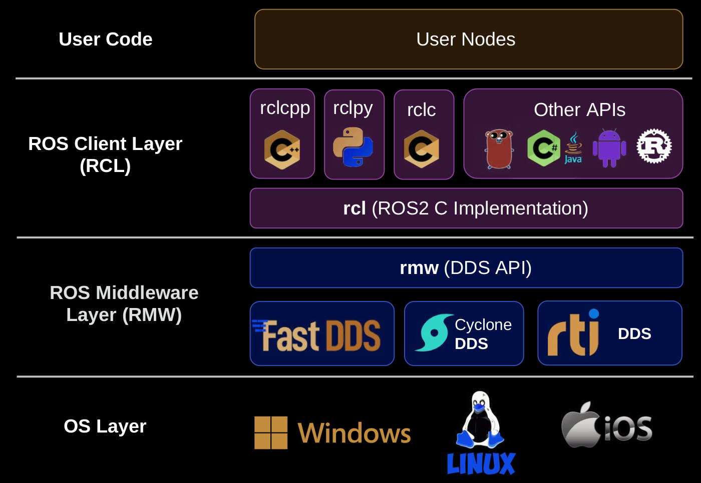

# Session 2

## Table of Contents

- [ROS 2 Design](#ros-2-design)
  - [Choosing DDS Implementations](#choosing-dds-implementations)
- [ROS 2 Client libraries](#ros-2-client-libraries)

## ROS 2 Design

In ROS 2, the design is organized into layers that facilitate efficient communication and interaction within the system. Figure 1.7 illustrates the layers that compose the ROS 2 design:

1. **User Code:** This is where your custom code and nodes reside, providing the functionality you desire in your robotic applications.

2. **ROS Client Layer (RCL):** Below the user code, there's the ROS Client Layer, which includes client libraries like `rclcpp` (C++) and `rclpy` (Python). If you're developing nodes and programs in C++, you'll use `rclcpp`, while Python packages use `rclpy`. It's important to note that `rclcpp` and `rclpy` are not entirely independent ROS 2 implementations. Thus, a node in Python may behave differently from one written in C++. Both libraries use `rcl`, which implements the basic functionality of all ROS 2 elements.

3. **ROS Middleware Layer (RMW):** The ROS Middleware Layer, represented by `rmw`, interfaces with the underlying middleware, in this case, DDS (Data Distribution Service). It provides a unified API to access the functionality of different DDS implementations. ROS 2 has chosen DDS as its communications layer due to its real-time characteristics, security capabilities, and customizable quality of service. DDS enables the exchange of information between processes in a distributed system like ROS 2, even across multiple machines.

4. **ROS Middleware (DDS API):** The DDS API, which ROS 2 relies on, is implemented over UDP. DDS allows for real-time communication between processes and offers security features and customizable quality of service for each connection. It follows a publication/subscription communication paradigm, enabling the discovery of publishers and subscribers without requiring a centralized service. DDS uses multicast for discovery and subsequent connections are unicast.

5. **OS Layer:** This layer is the operating system layer where ROS 2 runs. It provides the necessary system-level functionality to execute ROS 2 nodes and applications.

### Choosing DDS Implementations

ROS 2 supports various DDS implementations, including FastDDS, CycloneDDS, and RTI Connext. These implementations fully or partially adhere to the DDS standard defined by the OMG (Object Management Group). ROS 2 can use any of these DDS implementations, and developers can select one based on their specific requirements.

To choose a DDS implementation in ROS 2, you can modify the `RMW_IMPLEMENTATION` environment variable. In the Foxy distribution, the official DDS version is FastDDS, while in Galactic, it is CycloneDDS. The selection may have performance implications, so it's advisable to consider your application's needs when choosing a DDS implementation.

For further information, you can explore these additional resources:

- [ROS 2 Go (ROS 2 Go API)](https://github.com/tiiuae/rclgo)
- [OMG DDS Portal](https://www.omg.org/omg-dds-portal/)

This understanding of the ROS 2 design layers will be valuable as you develop more complex robotic applications in the upcoming sessions.

## ROS 2 Client Libraries

In the world of ROS 2, client libraries play a pivotal role in enabling communication between nodes and building the core functionality of robotic applications. These libraries provide a structured and language-specific way to interact with ROS 2, making it easier for developers to create powerful robotic systems.

For a comprehensive understanding of ROS 2 Client Libraries, refer to the [ROS 2 Beginner Client Libraries Tutorial](https://docs.ros.org/en/foxy/Tutorials/Beginner-Client-Libraries.html) for step-by-step instructions, code examples, and hands-on exercises. It's an essential resource to deepen your understanding of ROS 2 client libraries and their applications in robotics.

In this tutorial, you will learn about:

1. **Client Libraries Overview:** Get an overview of ROS 2 client libraries and their significance in developing robotic applications.

2. **RCLCPP (C++ Client Library):** Explore the C++ client library, `rclcpp`, and learn how to use it to create nodes, publish and subscribe to topics, use services, work with parameters, and utilize actions.

3. **RCLPY (Python Client Library):** Delve into the Python client library, `rclpy`, and discover how to perform tasks similar to those in `rclcpp`, including working with nodes, topics, services, parameters, and actions.

4. **Client Libraries Compatibility:** Understand how different client libraries (C++, Python, and more) can work together seamlessly within the ROS 2 ecosystem.

By following this tutorial, you'll gain valuable insights into the role of client libraries in ROS 2 development and acquire practical skills for building robotic applications using these libraries.

