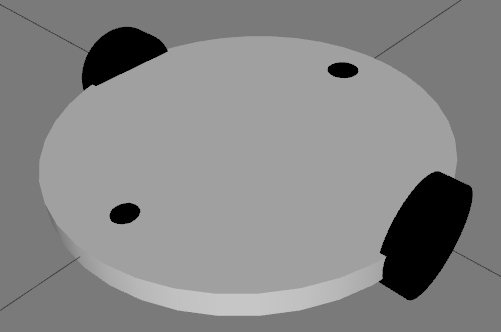

# Session 4: SLAM and Navigation with ROS 1

## Table of Contents

- [Using ROS 1 to SLAM in Gazebo](#using-ros-1-to-slam-in-gazebo)
  - [Differential Wheeled Robot Simulation with Laser Scanner in Gazebo](#differential-wheeled-robot-simulation-with-laser-scanner-in-gazebo)
  - [SLAM (Simultaneous Localization and Mapping)](#slam-simultaneous-localization-and-mapping)
  - [Navigation](#navigation)

## Using ROS 1 to SLAM in Gazebo

In this session, we will explore how to use ROS 1 to perform Simultaneous Localization and Mapping (SLAM) and Navigation in the Gazebo simulation environment. We'll start by introducing the differential wheeled robot and visualizing it in RViz.

To visualize the robot, use the following command:

```bash
$ roslaunch mastering_ros_robot_description_pkg view_mobile_robot.launch
```



You can also examine the URDF and Xacro files to gain insights into the robot's design and sensors.
Next, there are two essential packages: `diff_wheeled_robot_control` for robot speed control and `diff_wheeled_robot_gazebo` for mapping and navigation in Gazebo. We'll primarily focus on `diff_wheeled_robot_gazebo` in this session.

### Differential Wheeled Robot Simulation with Laser Scanner in Gazebo

To simulate the robot in Gazebo, we have four launch files that allow us to simulate with or without a laser scanner, publish the ROS TF (full), and include a house map for mapping and navigation. The available options are:

```bash
$ roslaunch diff_wheeled_robot_gazebo diff_wheeled_gazebo.launch
$ roslaunch diff_wheeled_robot_gazebo diff_wheeled_gazebo_with_laser.launch
$ roslaunch diff_wheeled_robot_gazebo diff_wheeled_gazebo_full.launch
$ roslaunch diff_wheeled_robot_gazebo diff_wheeled_gazebo_full_house.launch
```

For our use case, the most comprehensive option is the last one. Running this command should provide a simulation environment.

Now, let's examine the RQt Node Graph to understand how the robot state publisher, joint state publisher, and Gazebo nodes contribute to publishing the TF. Additionally, take a look at the TF tree to explore information about TF publishers.


### SLAM (Simultaneous Localization and Mapping)

This launch file is used to create a map of the environment using the laser scanner. To run SLAM and visualize the environment while creating the map, use these commands:

```bash
$ roslaunch diff_wheeled_robot_gazebo gmapping.launch
$ roslaunch diff_wheeled_robot_control keyboard_teleop.launch
```

To visualize the map during its creation process, open RViz and add the map, changing the topic to `/map`. It's advisable to follow a wall while creating the map.
After creating the entire map of the environment (house), save the map using the `map_server` package:

```bash
rosrun map_server map_saver -f <map_name>
```

Take another look at the TF tree and Node graph to gain insights into what's happening behind the scenes. You'll notice the map frame, which is added to represent the map's relationship to the robot. It's based on the position of the robot relative to the laser scanner data.


Additionally, there are several parameters configured in the Gmapping launch file. Take the time to read and understand the purpose of each parameter and the comments associated with them. For more comprehensive information about these parameters and Gmapping in general, please refer to the [Gmapping Wiki](http://wiki.ros.org/gmapping).
Once you've saved the map, you should see both an image and a YAML file with the name you've chosen. Close all running programs and proceed to the next section to learn about Navigation.

### Navigation

To start Navigation, launch the robot in Gazebo within the house environment and use the `navigation` launch file. It defaults to using the previously saved map, but you can load a different map using the `map_server`. Use these commands:

```bash
$ roslaunch diff_wheeled_robot_gazebo diff_wheeled_gazebo_full.launch
$ roslaunch diff_wheeled_robot_gazebo navigation.launch
$ rosrun map_server map_server <path>/<map_name>.yaml
```

Now, you can use the 2D Pose Estimate and 2D Nav Goal tools in RViz to set the robot's initial position and navigate it to different goals.

Explore the local and global cost maps, local and global paths, and the laser scan data in RViz. To learn more about the move_base structure and parameter adjustments, refer to the [move_base Wiki](http://wiki.ros.org/move_base).
