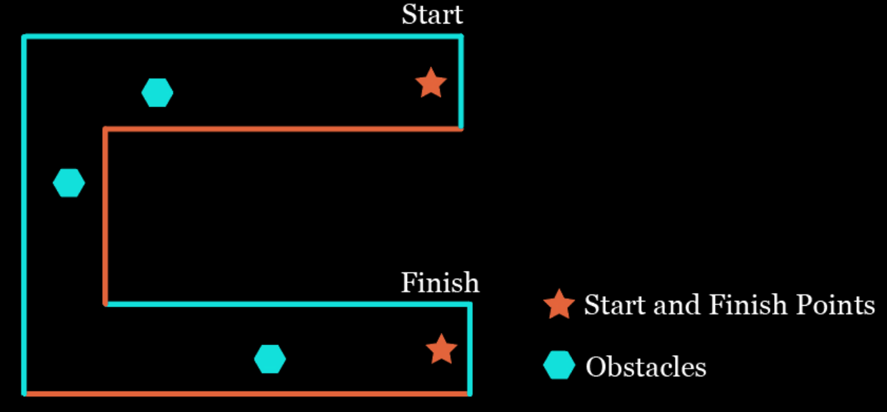

# Session 8:

## Group Mini Project 2

Design a package that drives the robot between two designated points with obstacle avoidance. In this project, the points are selected in a way that the robot needs to move in a U shape and robot should not pass any wall or red tape.

