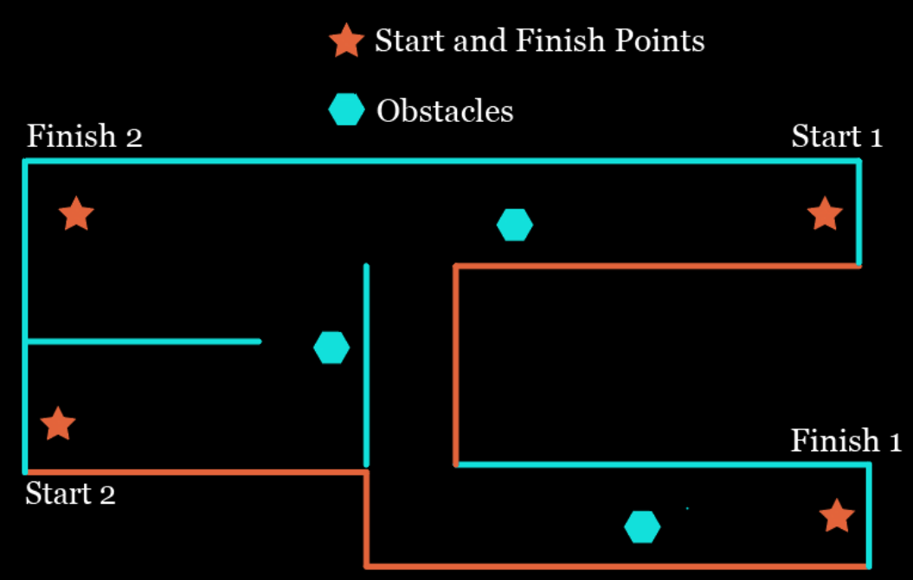

# Session 10: Mini Project 4

## Group Mini Project 4

Similar to previous projects, design a package that drives the robot from start 1 to finish 1 and pick up an object, go back to start 1 and place the object. Then drive the robot to start 2 and do the similar task.

