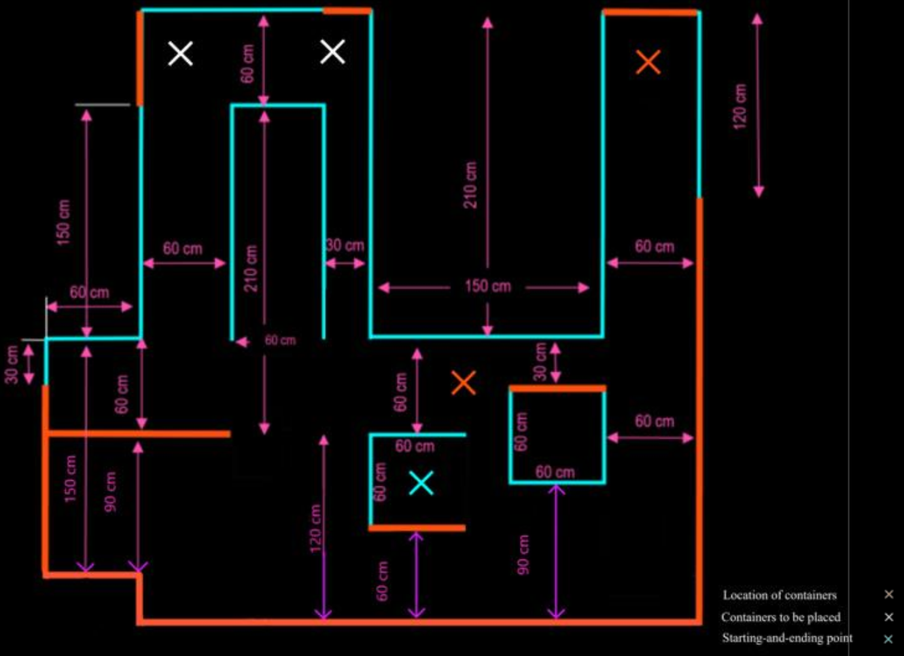

# Session 11: Final Project

## Final Project

A manufacturing company has procured a few mobile robots to handle materials on the site. There are two containers that contain extremely hazardous materials and need to be moved to designated areas within the facility. Robots are equipped with onboard LIDAR and vision systems, but are constrained to move within specific lanes. The path is illustrated in figure 1. For this project, your team is required to prototype the mission by building and programming a TurtleBot 3 Waffle which must pick up the containers located at some specific areas (indicated with blue crosses) and place them in the hazardous storage area, marked with black crosses. The specific path of the robot is to be decided by your team, as for the purpose of creativity, this task is intended to be open-ended. The robot is expected to demonstrate logical motions to properly accomplish the desired task. In the end of its mission, the robot must go back to and park in its cell.

